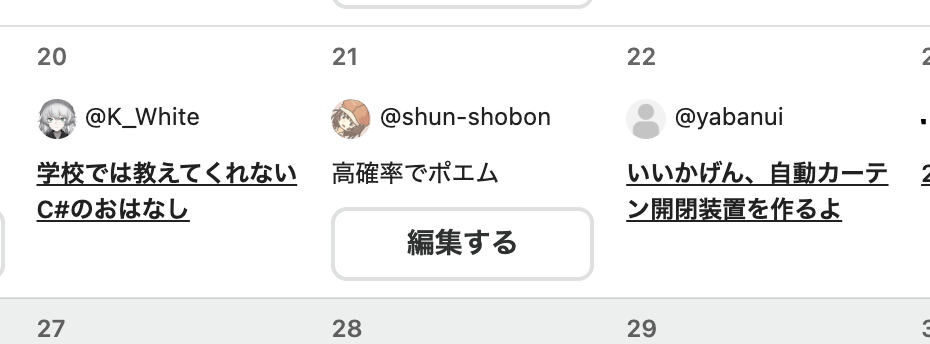

# アドベントカレンダーを3年間主催した話

この記事は[長野高専 Advent Calendar 2023](https://qiita.com/advent-calendar/2023/nnct)の25日目の記事です。

## はじめに

今日はクリスマスですね。皆さんはどんなクリスマスを過ごされましたか？私はAstro触ってたらクリスマスが終わってました。

今年も長野高専のアドベントカレンダーにはたくさんの記事が投稿されました。いろんな人が参加してくださり、本当にありがたい限りです。

…ん？

**本当にすみませんでした。21日目の記事は間に合いませんでした。**
ネタが思いつかなくて結局書けませんでした。冬休みが終わるまでには投稿しようと思います。
~~他の人も結構間に合ってないからいいよね？~~

ちなみに2つ目のカレンダーはまだ結構開いているのでクリスマス過ぎたあとでも投稿していただけると嬉しいです。冬休み暇な方は是非投稿してみてはいかがでしょうか。

さて、謝罪も済んだところで今年のアドベントカレンダーを振り返ってみたいと思います。
私が読んでみて面白かった記事をいくつかピックアップするので、まだ読んでいない人はぜひ読んでみてください。

## 面白かった記事

### [文化祭でクラス企画のシステムを作った話](https://qiita.com/Crysta1221/items/627ae9b51f662b52946b) by [Crysta1221](https://qiita.com/Crysta1221)

長野高専の学園祭である工嶺祭のクラス企画で作ったスコアサーバーの話です。
本校の工嶺祭はクラスごとに個性豊かな企画を行いますが、スコアサーバーを作って公開するようなところはなかなか居ません。
しかもCrysta1221さんは現在3年生という…長野高専の今後は明るいですね。

### [BuildrootとGitHub Actionsでつくる、自分だけのRaspberry Pi](https://zenn.dev/enchan1207/articles/bdcbff1ba58943) by [Enchan](https://zenn.dev/enchan1207)

Raspberry PiのイメージをGitHub Actionsでビルドする話です。
流石専攻科2年生という感じの記事で、かなりレベルが高いです。
私はインフラ関連の知識が全く無いので、この記事を読んでいろいろ勉強になりました。
というかbuildrootを初めて知りました。
また古いRaspberry Pi引っ張り出してきて遊ぼうかな…

### [透き通るような世界観で送る学会RTA](https://qiita.com/Nighthawks/items/1c8b142f30ef1860aa02) by [NightHawks](https://qiita.com/Nighthawks)

~~怪文書です。~~ 5年生になると稀に発生する学会発表の話です。
私の研究室では学会発表はありませんが、いくつかの研究室では学会発表があったりします。
発表力も鍛えられますし、他の人の研究を知ることもできるので、皆さんも5年生になったら挑戦してみてはいかがでしょうか。

### [月曜日をもっと楽しく迎えるbot](https://qiita.com/BonyChops/items/e0a8fefc4422167fb5b9) by [BonyChops](https://qiita.com/BonyChops)

おもしろアプリ枠です。完全にネタbotなのに、技術的にはかなりレベルが高いところがまた面白いです。
Discord botは気軽に作れる割には結構面白いので、皆さんも作ってみてはいかがでしょうか。

### [yellowshell1024](https://qiita.com/yellowshell1024) の記事

まさかの6記事投稿です。ポエムから技術記事まで幅広く投稿してくれました。
本当にいつも助かっています。ありがとうございます。
特に卒業研究の記事は面白かったので、皆さんも読んでみてください。

## 終わりに

このアドベントカレンダーは2021年から3年間続いていますが、これも皆さんのおかげです。
最初は全く記事が投稿されず、カレンダーも埋まらないという絶望的な状況でしたが、2年目3年目と年々参加者が増えていき、今年はなんと21人が参加してくれました。
皆さんの個性豊かな記事のお陰で、今年の長野高専の12月も盛り上がったのでは無いでしょうか。

私も今年で5年生で、もうすぐ卒業です(卒業できれば)。
流石に来年は長野高専のアドベントカレンダーを主催することは無いと思いますが、もし来年もあれば是非参加してみてください。OB参加が可能であれば、私も参加したいと思います。
