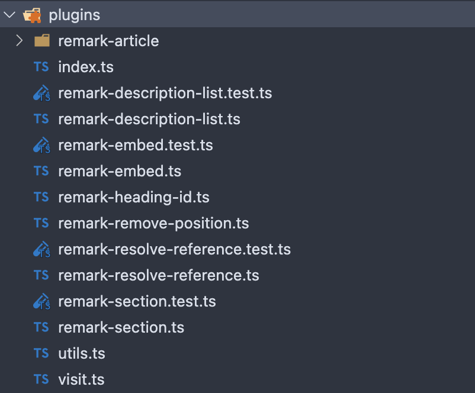

# blog.s2n.tech v2 のリリース

## はじめに

このブログは元々 2021 年末に唐突に自作のブログが作りたくなって急遽作ったものだったのですが，
急ごしらえで作ったせいか，色々と機能不足だったり，問題があったりと不満点がたくさんありました．

そこで今回自作ブログを大幅にリニューアルし，機能の追加，問題の解決を行いました．

## v1 における問題点

v1 時代のブログシステムにおける問題点は以下のとおりです．

- ローカルの画像表示，表に対応していない．
- パーサがクライアントサイドに展開される設計のため，クライアントサイドの JS ファイルが大きい．
- Common Mark + GFM [^gfm] 以外だと，数式表示くらいしか機能がなく，独自の拡張記法も無いので表現力に乏しい．
  - 特に外部リンクの OGP 表示や Twitter・YouTube の埋め込みが無いのが不便．
- Tailwind CSS でスタイルをいきあたりばったりで当てているので，スタイルが統一されていない．
  - ライトテーマのみでダークテーマが無い．
- OGP 画像を自動生成する機能が無い．
  - https://unsplash.com/ からランダムに画像を取得するようにしていた．

これらの問題点を解決するために，v2 では様々な機能を追加しました．

## v2 の機能

### Markdown パーサの拡張

v1 では元々 [remark](https://github.com/remarkjs/remark) をほぼそのまま使っていて，
そこに追加で GFM [^gfm] と数式ブロックの拡張を行っていた程度でした．

v2 では remark 用の独自のプラグインを作成し，自分でいくつかの構文拡張や AST の変換を行うことでより自分が扱いやすいようにしました．
作成したプラグインは以下のとおりです．

- `remark-resolve-reference`:
  - リンクや画像の参照を解決するプラグイン．Markdown には`[id]: url`という形式で
    URL を定義してそれをリンクや画像から参照できる機能がありますが，
    これをそのままにしておくとレンダリングの際に扱いづらいので，このプラグインで全て参照解決しています．
    ちなみに参照解決に失敗すると AST をテキストに変換するようにしています．
- `remark-embed`:
  - 独自記法である`embed`ブロックを発見，変換するプラグイン．
    段落に単体のリンクがあり，リンクテキストと URL が一致している場合にこの独自記法である`embed`に変換されます．
    `embed`はリンク先の OGP 情報を取得してカードとして表示したり，Twitter・YouTube の埋め込みを行うブロックです．
- `remark-remove-position`:
  - パースの際に生成されるソースとの位置情報を削除するプラグイン．
    レンダリングには位置情報は不要なので削除してしまいます．
    (どうせ他のプラグインで色々変換してるせいで位置情報はあまりあてになりません)
- `remark-heading-id`:
  - 見出しに一意な ID を付与するプラグイン．
    見出しジャンプや目次生成，ARIA ラベルでの参照などに使用します．
- `remark-description-list`:
  - 独自記法である`descriptionList`ブロックを発見，変換するプラグイン．
    今現在使用しているような HTML でいう`<dl>`, `<dt>`, `<dd>`タグを表現するための記法を追加します．
    このプラグインがない場合(= GitHub 上など他のサービス)でもある程度きれいに見えてほしいので，
    箇条書きを特定の形式で書いた場合に`descriptionList`に変換するようにしています．
- `remark-section`:
  - 独自記法である`section`ブロックを発見，変換するプラグイン．
    このブロックは`section`タグを表現するための記法です．
    これによって HTML にレンダリングした際により semantic な HTML が生成されます．
- `remark-article`:
  - 上記では処理しきれなかったファイルアクセスが伴う処理や大幅な変換が必要な処理を一手に担います．
    変換結果は`article`ブロックとして表現され，一つの記事に必要な記事の更新日や URL の slug などの情報を持つように変換されます．
    (正直単一責任原則違反な気がしてるので，将来的には分割したいです)

これらのプラグインはそれぞれファイル分けして適宜テストなどを書いていたのですが，プラグインにしたらかなりの量になってしまい正直驚きました．

これらのプラグインを使った Markdown ファイルのパース・変換は全て Next.js のビルド前に行うようにしています．
変換後はただの JSON として扱えるので JSON ファイルとして出力してレンダリングの際はそれを読み込むようにしています．
これによってクライアントサイドどころかサーバーサイドにもパーサを配置する必要がなくなり，かなりの軽量化に繋がりました．

### OGP 画像の生成

v1 では OGP 画像を自動生成する機能が無かったので，v2 では自動生成する機能を追加しました．
これは少し前に話題になった [`@vercel/og`](https://vercel.com/docs/concepts/functions/edge-functions/og-image-generation) を利用しています．
`@vercel/og` は Edge Function で動作する動的な OGP 画像生成ライブラリです．
JSX を使って普段の React と同じ用にコンポーネントを与えるとそれを SVG→PNG に変換し，OGP 画像として返してくれます．

かなりお手軽につかえて便利……と思いきや，デフォルトでは日本語フォントが含まれていないので，日本語を含む OGP 画像を生成するにはフォントを追加する必要がありました．
そして，日本語フォントというのは非常にファイルサイズが大きいので普通に使おうとすると Edge Function に載りません．
(Edge Functions はスクリプトやアセットファイルを含めて hobby プランの場合最大 1MB の制限がある)

`@vercel/og`とそれを扱うコードを合わせると大体 500KB ほどになるので，
これにアイコンや背景用の画像を含めるとフォントファイル用の余裕はほぼありません．
[参考にしていた記事](https://zenn.dev/hiromu617/articles/c03fef6f4d6c6e)ではフォントのサブセット化を事前に行い，
フォントファイルを 500KB ほどにしていましたが，自分がやってみた場合はどうやっても 1MB に収まらず(1.1MB とか 1.03MB とかかなりギリギリはみ出してしまった)，別の方法を考える必要がありました．

最終的には`@vercel/og`が利用しているライブラリである`satori`の[Example](https://github.com/vercel/satori/blob/83d658542719c5cf0ea2354e782489f9e1e60a84/playground/pages/api/font.ts)にあった，
Google Fonts からサブセット化したフォントを動的に取得する方法を採用しました．
この方法は Google Fonts 取得した CSS からフォントファイルの URL を正規表現で抽出していたので若干不安定な気もしますが，
とりあえずしばらくはこの方法を使ってみようと思います．

ところで，`@vercel/og`は Next.js の旧式の API Routing システムである`pages/api`を使っているのですが，
新たな App Dir で使用できる`app/**/route.ts`での書き方がまだ使えないようです．
というか何故か`route.ts`で`satori`を import しようとすると`satori`に default export が無いと怒られてしまうので謎です．(もちろん`satori`には default export があります)

**2023/03/08 追記:** `@vercel/og@0.4.0`から`route.ts`での使用が可能になったようです．

### Next.js による React Server Component の使用

v2 のブログシステムでは Next.js 13 で追加された React Server Component(RSC) を使用しています．
RSC では React のコンポーネントは Server 側と Client 側で完全に分離することが可能なので，
静的なレンダリングがしやすいブログサイトでは非常に有効です．
今回はシンタックスハイライトや数式表示などの RSC にまだ非対応なライブラリを使用している箇所以外は全て Server Side でレンダリングしています．

本当はシンタックスハイライトや TeX 数式の変換もサーバー上で行いたかったのですが，
そのまま使うのは難しそうなのでそのうち挑戦したいなと思っています．

## 今後やりたいこと

とりあえずブログとしては仕上がりましたが，まだ追加したい機能はたくさんあります．
TOC(目次)の追加と表示や，記事の検索機能，関連記事の表示などです．
また，現時点では記事のレンダリングは実際にビルドしないとわからないのですが，執筆途中の記事のプレビュー機能も追加したいです．

## まとめ

v2 では Next.js の最新機能である React Server Component を使ったり，マークダウンのパーサを拡張したりして，かなりの軽量化や機能追加を行うことができました．
今後もブログシステムは改善していきたいなと思っています．

[^gfm]:
    GitHub Flavored Markdown の略．標準規格である Common Mark に GitHub が拡張したもの．
    取り消し線やテーブルなどが追加されている．
