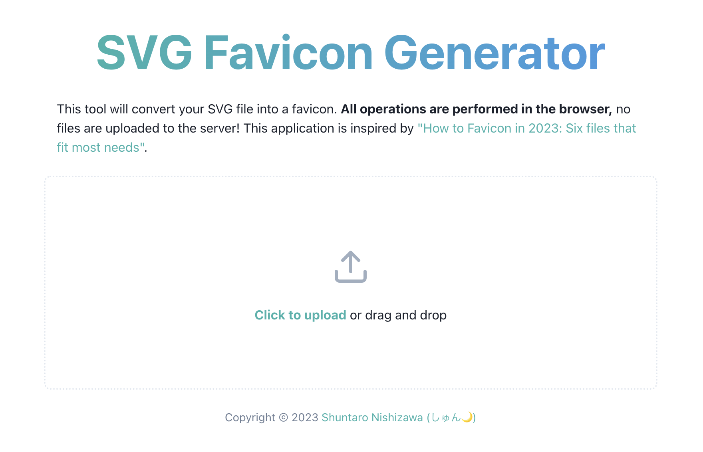

# ブラウザ上で動くファビコンジェネレーターを作った

## はじめに

この前[blog.s2n.tech v2 をリリースしました](blog-v2)が，
その時に動的に OGP 画像を生成するために @vercel/og というライブラリを使用しました．

@vercel/og は大まかには JSX を SVG に変換する処理と SVG を PNG に変換する処理を内部で行っているのですが，
その SVG を PNG に変換するライブラリである @resvg/resvg-wasm に今回は興味が出たのでそれを使って簡単なツールを作りました．

## 作ったもの

今回作ったものは **SVG Favicon Generator** というもので，
SVG 画像を与えるとそれを `favicon.ico` やその他 iOS や Android で使用されるようなアイコン画像に一括で変換してくれるツールです．
変換された画像は ZIP 形式でまとめてダウンロードできます．
かなり単純なツールですので良かったら使ってみてください．

https://favicon-generator.s2n.tech



ソースコードは GitHub で公開してます．なにかあれば Issue や PR を送っていただけると嬉しいです．

https://github.com/shun-shobon/favicon-generator

## 使った技術

今回は以下の技術を使って作りました．

- React
- TypeScript
- Vite
- @resvg/resvg-wasm
- ~~WebAssembly~~
- CloudFlare Pages

今回はその中でも @resvg/resvg-wasm と WebAssembly と JavaScript のバイナリ操作について説明します．

### @resvg/resvg-wasm

@resvg/resvg-wasm は WebAssembly で実装された SVG 画像を PNG に変換するライブラリです．
本来は CloudFlare Workers 上などでの動作が想定されて作られたツールですが，
内部的には WASM を使っているだけなのでブラウザ上でも動作します．
使い方も簡単で，WASM ファイルを `initWasm` で読み込んだあとに `Resvg` クラスに SVG の文字列を渡せば PNG に変換してくれます．

```typescript
import { initWasm, Resvg } from "@resvg/resvg-wasm";
// Viteの機能を使ってWASMファイルのURLを取得
import wasmUrl from "@resvg/resvg-wasm/index_bg.wasm?url";

const svg = "<svg>...</svg>";

await initWasm(fetch(wasmUrl));
const resvg = new Resvg(svg); // SVGを読み込む
const image = resvg.render(); // ラスター画像に変換
const pngBuffer = image.toPng(); // PNGに変換
```

ただ若干面倒なところとして，SVG ファイルのリサイズに若干クセが有り，
幅か高さを選んで値を指定するとそれに合わせてもう一方の長さもリサイズされるという仕様のようです．

### WebAssembly

今回はファビコンジェネレーターということでよくある PNG 以外にも ICO 形式というかなり珍しいファイル形式を扱う必要がありました．
ICO に変換できるライブラリも良さそうなものが見つからなかったので，自分で仕様を調べて実装しました．
ICO は複数の画像を含めることができますが，今回は 1 つの画像しか含む予定は無かったのでかなりの手抜き実装です．

ICO の仕様自体はかなり単純で，ICO 自体のヘッダー，それぞれの画像用のヘッダー(複数)，それぞれの画像データ(複数)の順番でデータが並んでいるだけです．
内部の画像データは仕様上は BMP や PNG を扱えるはずなのですが， PNG で実装したところうまく行かず，
ImageMagick などのツールも BMP 形式で出力しているようだったので BMP 形式を使うことにしました．
ところがこの BMP というのがまあまあ厄介で，バイナリ上のピクセルの並びが左下からだったり，色の並びが BGRA だったりとなかなか面倒な仕様になっています．

バイナリの処理は JavaScript で行うのは面倒そうだなという先入観と，WebAssembly を触ってみたかったので，Rust を使って実装しました．
Rust で WASM ファイルを出力するのはかなり簡単で，wasm-pack というビルドツールや，wasm-bindgen という JS とのインターフェースを提供するライブラリを使うとかなり簡単に実装できます．

```rust
#[wasm_bindgen]
pub fn to_ico(width: u32, height: u32, pixels: Uint8Array) -> Uint8Array {
    let bmp_height = height * 2; // Double height for XOR and AND masks
    let bmp_image_size = bmp_height * width * 4;
    let bmp_size = BMP_INFO_HEADER_SIZE + bmp_image_size as usize;

    let pixels = pixels.to_vec();

    let buffer_size = ICO_HEADER_SIZE + ICO_DIR_ENTRY_SIZE + bmp_size;
    let mut buffer = vec![0; buffer_size];
    let mut cursor = Cursor::new(&mut buffer);

    // ICO header
    cursor.write_all(&0u16.to_le_bytes()).unwrap(); // Reserved
    cursor.write_all(&1u16.to_le_bytes()).unwrap(); // Type: 1 = ICO
    cursor.write_all(&1u16.to_le_bytes()).unwrap(); // Number of images

    // ...
}
```

で，実際に実装して動作することも確認したのですが，あとから「これ CI でビルドするときに色々ツールダウンロードしたりしないといけなくて面倒じゃね？」と思い，
結局 JavaScript で実装し直しました．
JavaScript の `TypedArray` を使ったバイナリ操作も興味があったのでいい機会だなと思って実装しました．

## JavaScript でのバイナリ操作

JavaScript はあまりバイナリ操作を扱うイメージがありませんが，意外とそのへんの機能は充実しています．
JavaScript にはバイナリ操作全般を扱うための `ArrayBuffer` と `TypedArray` というオブジェクトがあります．

`ArrayBuffer` はバイナリデータを格納するためのオブジェクトで最初にバイト数を指定して作成します．
`TypedArray` は `ArrayBuffer` に格納されたバイナリデータを扱うためのオブジェクトで，`ArrayBuffer` に格納されたデータの一部(または全部)を参照するように作成します．
`TypedArray` にはいくつか種類があり，それぞれの種類によってデータの型が異なってきます．
また複数の型を扱える `DataView` というオブジェクトもあり，今回はこれを使って実装しました．

```typescript
export function createIco(
  width: number,
  height: number,
  pixels: Uint8Array | Uint8ClampedArray
): Uint8Array {
  const bmpHeight = height * 2;
  const bmpImageSize = bmpHeight * width * 4;
  const bmpSize = BMP_INFO_HEADER_SIZE + bmpImageSize;

  const bufferSize = ICO_HEADER_SIZE + ICO_DIR_ENTRY_SIZE + bmpSize;
  const buffer = new ArrayBuffer(bufferSize);
  const cursor = new Cursor(buffer);

  // Write ICO header.
  cursor.writeUint16(0); // Reserved.
  cursor.writeUint16(1); // Type.
  cursor.writeUint16(1); // Number of images.

  // ...
}
```

`DataView` を普通に使うとどこまで書き込んだかなどの位置情報が扱えないので `Cursor` というクラスを作って位置情報を管理しています．

## 最後に

今回作ったものを通して，WebAssembly や JavaScript でのバイナリ操作について学ぶ事ができました．
ツールとしてもなかなか便利なものができたので，今後も使いたいなーと思っています．
