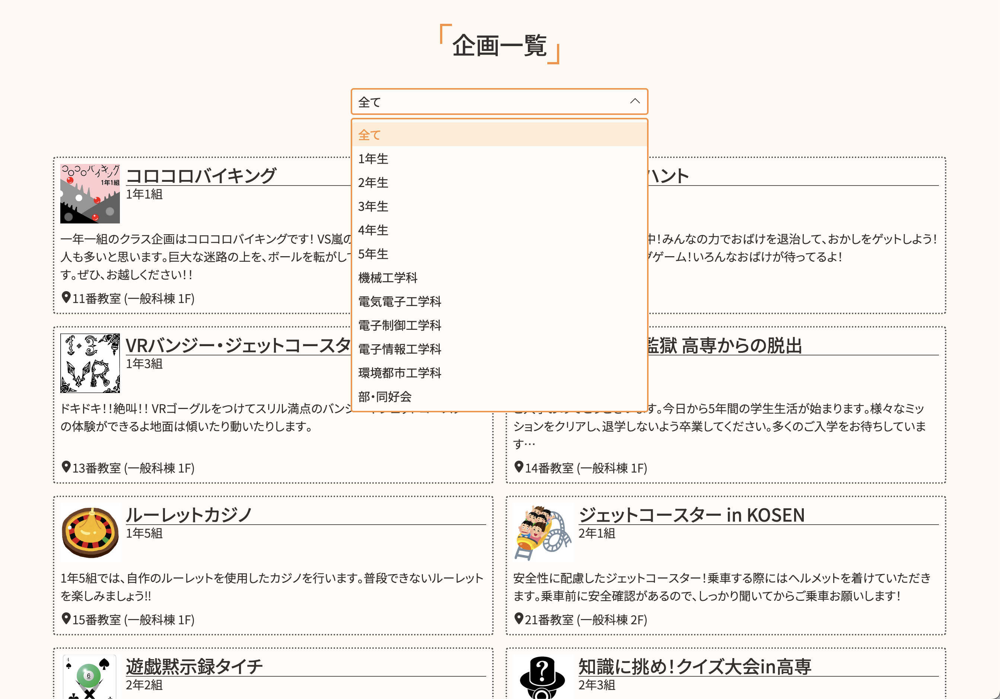
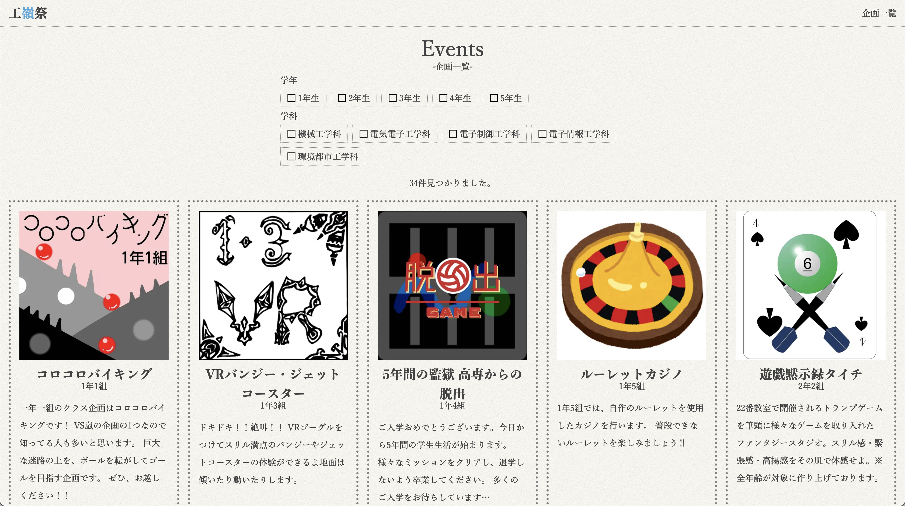
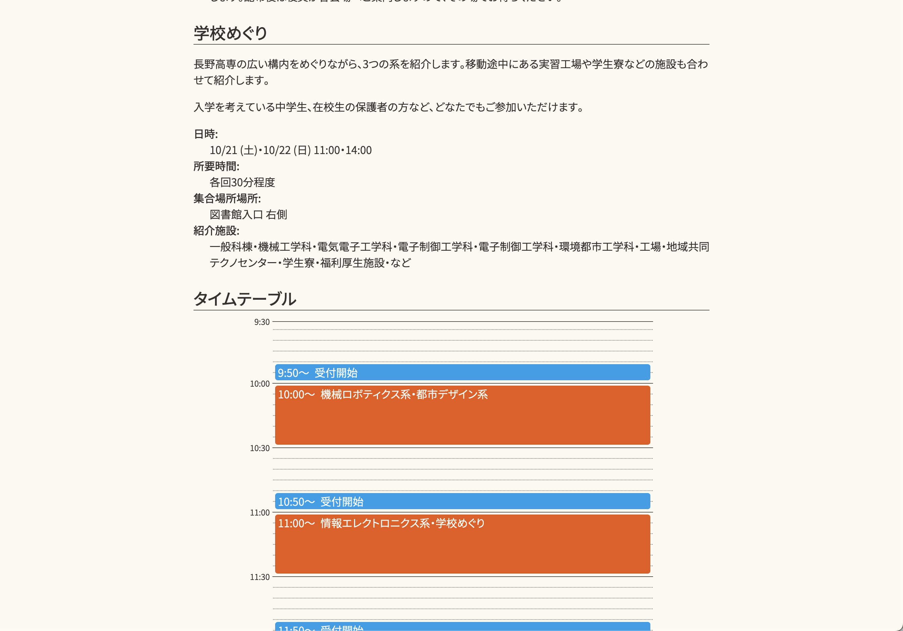
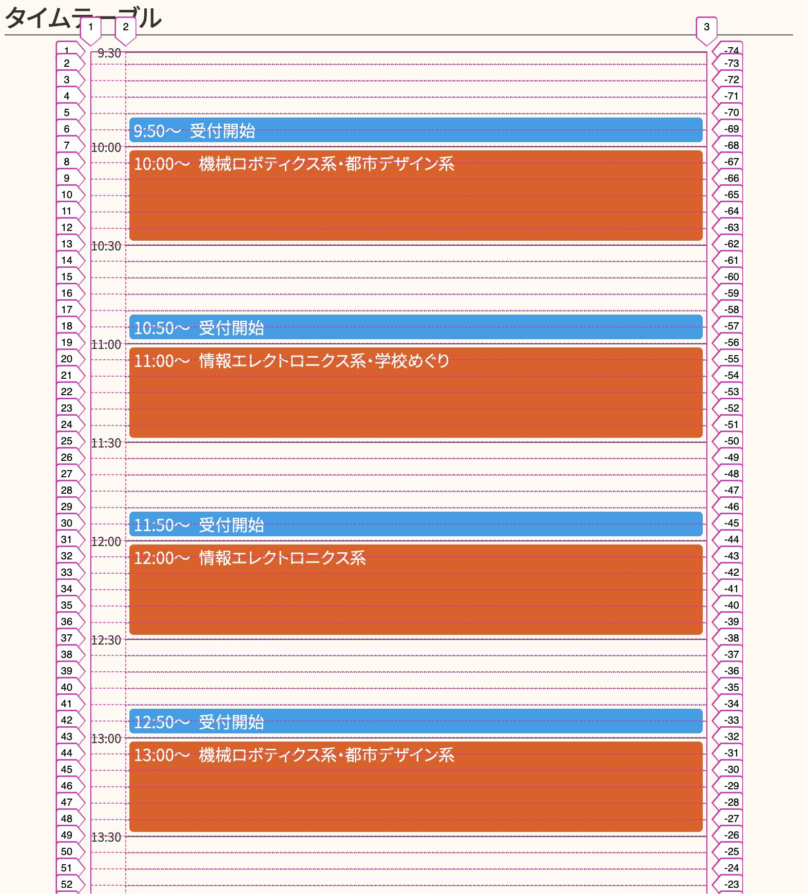
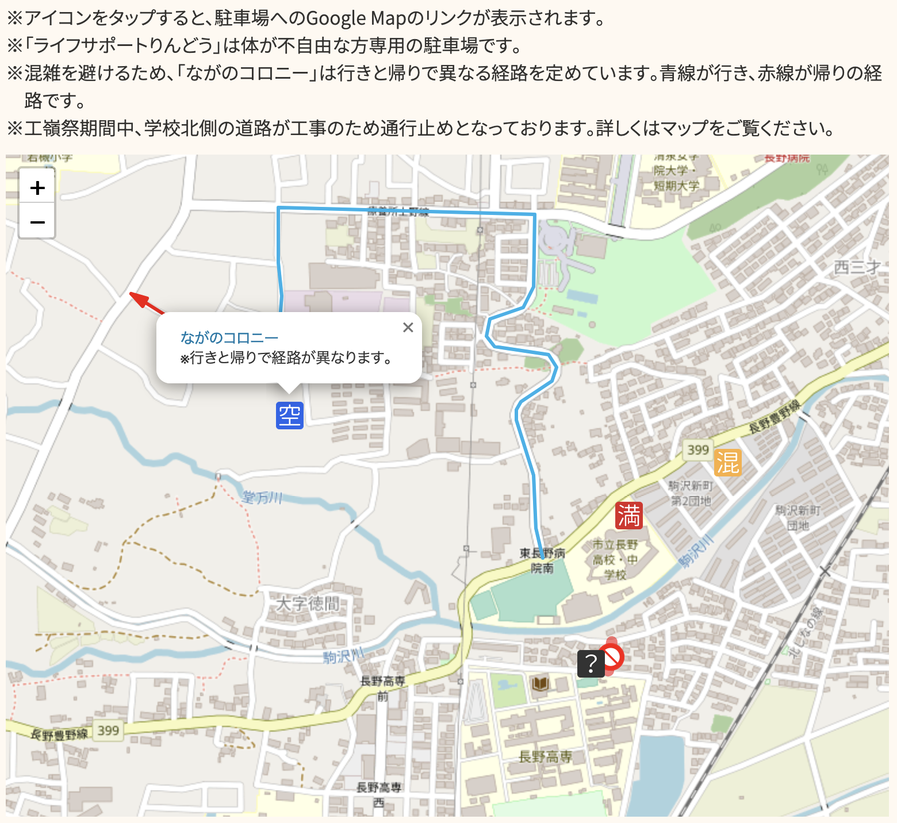
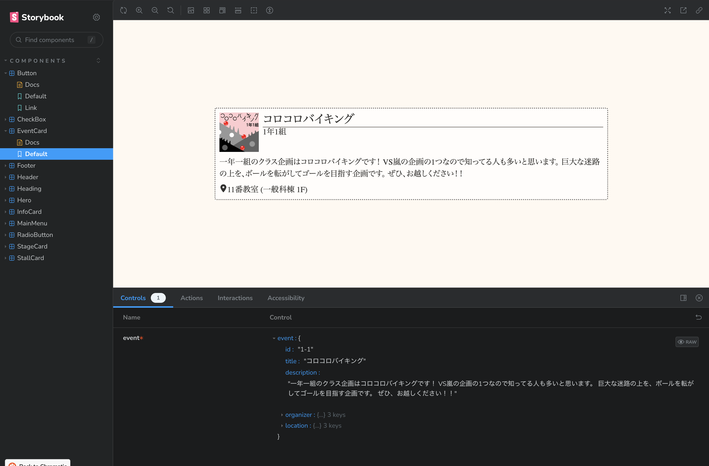
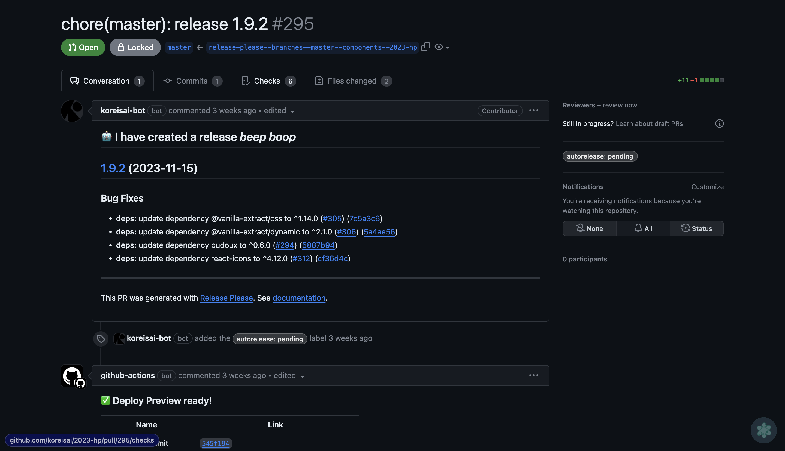

# 工嶺祭2023HP制作の裏側

## はじめに

私は今年の工嶺祭[^1]のHP制作を担当しました。ここでは制作にあたっての技術スタックや運用、工夫した点などを紹介します。
なお、この記事は私が自主的に書いたものであり、工嶺祭実行委員会や長野高専とは一切関係ございません。
本記事の内容に関して学校などに直接問い合わせることはご遠慮ください。

また、この記事は[長野高専 Advent Calendar 2023](https://qiita.com/advent-calendar/2023/nnct)の1日目の記事です。

[^1]: 長野高専の学園祭のこと

## どんなものを作ったのか

以下のURLから閲覧できます。(執筆時点でのことなので今後の更新で今年の分は閲覧できなくなる可能性があります)

https://koreisai.tech/


掲載している内容は以下の通りです。

- クラス・部・同好会企画の紹介
- 屋台の紹介
- 昼ステージ参加団体の紹介とタイムテーブル
- 各特別企画の説明
- 系紹介・体験プログラムの説明とタイムテーブル
- 交通アクセス

割と普通の学園祭HPだと思いますが、ちょっとだけこだわった点があるので後ほど紹介します。

## 制作までの経緯

実は2年前に工嶺祭にHPを作りたいという話が出ていました。
当時私は3年生で実行委員会とは特に関わりは無かったのですが、友人のつながりで偶然私に話が回ってきて担当することになりました。
そこから3年間、毎年工嶺祭のHPを作っています。

## 技術スタック

今年のHPは以下の技術スタックで作成しました。他にもLinterやCI/CDなども使用していますが、そのあたりは後ほど紹介します。

- Next.js
- TypeScript
- vanilla-extract

### Next.js

みんな大好きNext.jsです。Reactを用いたフレームワークで、Webフロントエンジニアなら誰でも知ってると思います。
今回はNext.jsを静的サイトジェネレータとして使用しています。
Next.jsはv13でルーティング周りの機能が大きく変化しており、App Routesと従来のPages Routesの二種類がありますが、今回はApp Routesを使用しています。

本当はApp RoutesのServer Componentsなどの機能も使いたかったのですが、インフラ周りの都合でレンタルサーバーしか使えなかったため、今回はServer Components等のサーバーサイドの機能は使っていません。

### TypeScript

これもWebフロントエンジニアなら誰でも知っていると思います。JavaScriptに型をつけることでより安全にコードを書くことができます。
私は普段からTypeScriptを常用しており、JavaScriptを使う理由が特になかったのでTypeScriptを採用しました。(コード書く人も私しかいなかったし)

### vanilla-extract

[vanilla-extract](https://vanilla-extract.style/)はCSS in JSタイプのスタイリングライブラリです。CSS Modulesのように使うことができ、TypeScriptを使えば強力な型支援を受けることもできます。
またvanilla-extractの他にはない特徴としてゼロランタイムであるということが挙げられます。
CSS in JSタイプのライブラリはJavaScriptを実行することで動的にCSSを生成することが多いですが、これにはオーバーヘッドが発生し、パフォーマンス的にも不利になる可能性があります。
また、ブラウザがJavaScriptを実行するまでCSSが適用されないという問題もあります。[^2]

[^2]: SSRやSSGだとまた少し異なってきますが、今回は特に言及しません。

今回はWeb Appと言うよりはWebサイトとして作成しているため、デザインが複雑になったり、アドホックにスタイルを変更することが多くなると考えました。
そのためフレームワーク的なものよりもライブラリ的なものを使用したほうが良いと思い、vanilla-extractを採用しました。
元々はCSS Modules(+ SCSS)にする予定でしたが、TypeScriptによる型支援が受けれたり、theme用の変数を定義するための機能があったりとCSS Modulesよりもvanilla-extractのほうが便利だったため、こちらを採用しました。

## HPの詳細

ここからはHPの機能や工夫した点、開発・運用時の流れなどを紹介します。

### 企画紹介ページ

工嶺祭では各クラスや部活・同好会が企画を出します。
全クラスが企画を出すためそれだけでも25企画になり、部活・同好会も含めるとなんと41企画もあります。

PCで閲覧するならともかく、狭いスマホの画面で41企画を1ページに表示してしまうとかなりの長さになってしまいます。
そのため、企画紹介ページでは学年や学科、部活・同好会ごとに絞り込みをかけることができるようなっています。



なお、この絞り込み用のUIは[Headless UI](https://headlessui.com/)というライブラリを使用しています。これを使うとロジック面で実装が難しいUIを簡単に実装することができるだけでなく、アクセシビリティも担保することができます。

```tsx
export function EventQuery({
  filter,
  onChangeFilter,
}: EventQueryProps): ReactNode {
  const selectedLebel = filterList.find((item) => item.value === filter)?.label;

  return (
    <form className={styles.query}>
      <div className={styles.listbox}>
        <Listbox value={filter} onChange={onChangeFilter}>
          <Listbox.Button className={styles.button}>
            {({ open }) => (
              <>
                {selectedLebel}
                <LiaAngleDownSolid
                  className={clsx(
                    styles.buttonIcon,
                    open && styles.buttonIconOpen,
                  )}
                />
              </>
            )}
          </Listbox.Button>
          <Transition
            as={Fragment}
            leave={styles.optionsLeave}
            leaveFrom={styles.optionsLeaveFrom}
            leaveTo={styles.optionsLeaveTo}
          >
            <Listbox.Options className={styles.options}>
              {filterList.map((item) => (
                <Listbox.Option
                  key={item.value}
                  value={item.value}
                  className={({ active, selected }) =>
                    clsx(
                      styles.option,
                      active && styles.optionActive,
                      selected && styles.optionSelected,
                    )
                  }
                >
                  {item.label}
                </Listbox.Option>
              ))}
            </Listbox.Options>
          </Transition>
        </Listbox>
      </div>
    </form>
  );
}
```

ちなみに1つの企画ごとのカードデザインも少しこだわっています。
元々は企画の画像を大きめに表示させた縦型のカードにしていました。ただ、これだとスマホで見た際に1画面に1企画程度しか表示されないため、スクロール量が多くなってしまいます。またPCで表示した際も改行が多くなってしまうため、見づらくなってしまいます。



画像よりも紹介文を重視したいということで、画像を小さめにして横型のカードにしました。これだとスマホでも1画面に2.5企画程度表示され、PCでも改行が少なくなり見やすくなります。

### 系紹介・体験プログラムの説明ページ

工嶺祭では一般来場者(中学生や小学生など)に向けた各系の紹介展示や体験プログラムを行います。
その紹介ページでは各系の紹介文や体験プログラムのタイムテーブルを掲載しています。



このタイムテーブルですが、これはCSS Gridを用いて1から実装しています。
本来は何かしらのライブラリを使うべきだとは思いますが、デザインに合致するライブラリが見つからなかったため、自作することにしました。

時間ごとにCSS Gridの行を割り振り、各スケジュールはCSS Gridの`grid-row`に行番号を指定する形で配置しています。
各スケジュールごとに`grid-row`の値は変わりますが、これはCSS変数を用いて実現しています。



かなり複雑なCSSとなってしまいましたが、vanilla-extractの機能を使用することで比較的簡潔に書くことができました。
CSS変数に関してもvanilla-extractの`createVar()`と`assignInlineVars`を使うことで、TypeScriptの型支援を受けながらCSS変数を使用することができます。

```ts
import { createVar, style } from "@vanilla-extract/css";

export const timetableDuration = createVar();

// タイムテーブル全体
export const timetable = style({
  display: "grid",
  gridTemplateColumns:
    "[time-start] auto [time-end program-start] 1fr [program-end]",
  gridTemplateRows: `auto repeat(calc(${timetableDuration} / 5), 1fr)`,
  lineHeight: 1,
  maxWidth: "600px",
  marginInline: "auto",
});

export const timeStart = createVar();
export const timeEnd = createVar();

// 時間ごとの横線
export const timeBorder = style({
  gridColumn: "time-end / -1",
  gridRow: `calc(${timeStart} + 1) / span 1`,
  borderTop: `1px dotted ${vars.color.border}`,
  zIndex: -1,
});

// スケジュール
export const program = style({
  gridColumn: "program-start / program-end",
  gridRow: `calc(${timeStart} + 1) / calc(${timeEnd} + 1)`,
  margin: "0.25rem",
  padding: "0.25rem",
  color: vars.color.textAccent,
  borderRadius: "0.25rem",
});
```

### 交通アクセスのページ

工嶺祭は外部からも多くの来場者が来ます。中には遠方から車で来る人もいますが、今年の工嶺祭では構内に駐車場がありません。
代わりに周辺の駐車場を借りているのですが、少々遠いためアクセス方法や場所をHP上で紹介することにしました。

駐車場の場所はマップ上に表示しています。また、駐車場の空き状況をリアルタイムで確認できるようになっており、空き状況に応じて別の駐車場に停めやすくなるようになっています。
駐車場の空き状況は[@RSa1t0](https://twitter.com/RSa1t0)さんが制作してくれたアプリ上で管理されており、駐車場係の方が空き状況を更新するとAPIを通してHP上でも更新されます。
他にも駐車場によっては行きと帰りで経路が決まっていたり、周辺道路が通行止めになっていたりもするので、そういった情報もマップに載せるようにしました。

これらの表示はOpenStreetMapというオープンソースの地図データと、Leaflet.jsという地図ライブラリを用いて実装しています(正確にはLeafletをReactで扱えるようにしたReact Leafletというライブラリを使用しています)。



なお、このReact LeafletはSSRに対応していないのですが、Next.jsではClient ComponentでもデフォルトでSSRされます。そのため、`next/dynamic`を用いてSSRを無効化するようにしています。

```tsx
import dynamic from "next/dynamic";

const Map = dynamic(() => import("./_components/Map"), { ssr: false });

export default function Page() {
  return (
    <main>
      {/* ... */}
      <Map />
    </main>
  )
}
```

### カウントダウンタイマー

トップページには工嶺祭までのカウントダウンタイマーを設置しています。
やっていることは単純で、1秒ごとに現在時刻との差分を取って表示しているだけです。
元々思いつきで追加したものなのですが、意外と好評でちょっとビックリしました。

https://twitter.com/shun_shobon/status/1715354027096186895

なお、日付や時刻の操作にはTemporal API(のPolyfill)を使用しています。
Temporal APIはJavaScriptのDate APIの代替として提案されているもので、現在はStage 3の提案となっています。
JavaScriptのDateはとても扱いづらいことで有名ですが、Temporalは非常に考えられており、扱いやすいです。
今回はPolyfillを使用していますが、将来的にはネイティブに実装されることを期待しています。

```tsx
const festivalStart = Temporal.ZonedDateTime.from(
  "2023-10-21T09:30:00+09:00[Asia/Tokyo]",
);
const festivalEnd = Temporal.ZonedDateTime.from(
  "2023-10-22T15:30:00+09:00[Asia/Tokyo]",
);
type FestivalState = "before" | "during" | "after";

export function CountdownTimer(): ReactNode {
  const [diff, setDiff] = useState(Temporal.Duration.from({ seconds: 0 }));
  const [festivalState, setFestivalState] = useState<FestivalState>("before");

  useEffect(() => {
    const update = () => {
      const now = Temporal.Now.zonedDateTimeISO("Asia/Tokyo");

      // 工嶺祭前
      if (Temporal.ZonedDateTime.compare(now, festivalStart) < 0) {
        setDiff(
          now.until(festivalStart, {
            largestUnit: "day", // 最大単位を日に設定
            smallestUnit: "second", // 最小単位を秒に設定
          }),
        );
        setFestivalState("before");
        return;
      }
      // 工嶺祭中
      if (Temporal.ZonedDateTime.compare(now, festivalEnd) < 0) {
        setDiff(
          now.until(festivalEnd, {
            largestUnit: "day",
            smallestUnit: "second",
          }),
        );
        setFestivalState("during");
        return;
      }

      // 工嶺祭後
      setDiff(Temporal.Duration.from({ seconds: 0 }));
      setFestivalState("after");
    };

    update();

    const id = setInterval(update, 1000);
    return () => clearInterval(id);
  }, [setDiff]);

  // ...
}
```

### Web CM

トップページにはPR用の動画を埋め込んでいます([@KOPONTAphoto](https://twitter.com/KOPONTAphoto)作)。
元データは.mov形式でしたが、流石にそれをそのまま使うとサイズが大きすぎるため、Web上でも再生できるように変換して埋め込んでいます。

`<video>`タグは複数のソースを指定することができるため、比較的新しく軽量な形式のWebMと、古いブラウザでも再生できるようにmp4を指定しています。

また、画面をスクロールした際に自動的に動画が再生されるようにIntersection Observer APIを使用しています。

```tsx
return (
  <video
    muted
    playsInline
    loop
    controls
    ref={videoRef}
    className={styles.video}
  >
    <source src="/assets/cm.webm" type="video/webm" />
    <source src="/assets/cm.mp4" type="video/mp4" />
  </video>
);
```

### フォント

HP内では源ノ角ゴシックを使用しています。これはAdobeが公開しているオープンソースの日本語フォントです。

Webフォント、特に日本語フォントはファイルサイズが大きくなりがちで、複数のウエイトを使用すると更にサイズがかさみます。
そのため、今回はバリアブルフォントと呼ばれるフォントを使用しています。
これは1つのフォントファイルに可変のウエイトを持たせることで、複数のウエイトを使用する際にファイルサイズを抑えることができます。

https://ics.media/entry/201008/

加えて、Next.jsの[Font Optimization機能](https://nextjs.org/docs/app/building-your-application/optimizing/fonts)を使用しています。
これによってリクエストが最適化され、よりパフォーマンスを出すことができます。

```tsx
import localFont from "next/font/local";

const font = localFont({
  src: "../assets/SourceHanSansJP-VF.otf.woff2",
  fallback: ["sans-serif"],
});
```

### アクセス解析

HPのアクセス解析にはGoogle Analyticsを使用しています。

Google AnalyticsはGoogleが提供している無料のアクセス解析ツールで、アクセス数やユーザー数はもちろんのこと、どのページがどれだけ閲覧されたかなども確認することができます。

アクセス数などをお見せすることはできませんが、非常に沢山の方に閲覧して頂いており、非常に嬉しい限りです。

なお、それ以外にもページ上でエラーが発生した際にそれをイベントとして送信するようにしているため、エラーが発生した際にはすぐに気づくことができます。

### エラー対策

Next.jsは非常に便利ですが、スマホなどでタブを復帰させた際にエラーになってしまうことがあります。
デフォルトのエラー画面は英語で分かりづらいので、自前のエラー画面を用意しています。

App Routesでは`global-error.tsx`というファイルにエラー画面を定義することでエラーが発生した際にそれを表示することができます。

なお、コンポーネントには`reset()`という関数が渡されており、これを呼ぶとリセット処理を走らせることができます。
今回はそこまで複雑なロジックはなく、リセット処理だけでどうにかなることが多いと考えたため、エラー画面が呼ばれた時点で自動的にリセット処理が走るようにしています。
それでもエラーが発生した場合にはユーザーにエラーが発生したことを知らせ、再読み込みを促すようにしています。
また、エラー画面で放置した際には自動的にリロードするようにしています。

```tsx
"use client";

import type { ReactNode } from "react";
import { useEffect, useLayoutEffect } from "react";

// このコンポーネントがレンダリングされると自動的にリセット処理が走る
// リセット処理が走ってもエラーが発生している場合は、エラー画面が表示される
let wasReset = false;

type GlobalErrorProps = {
  error: Error & { digest?: string };
  reset: () => void;
};

export default function GlobalError({ reset }: GlobalErrorProps): ReactNode {
  useLayoutEffect(() => {
    if (wasReset) return;
    wasReset = true;

    /* †死者蘇生† */
    reset();
  }, [reset]);

  useEffect(() => {
    const id = setTimeout(() => {
      window.location.reload();
    }, 60 * 1000);

    return () => {
      clearTimeout(id);
    };
  }, []);

  const handleReload = () => {
    window.location.reload();
  };

  return (
    <html lang="ja">
      <body
        style={{
          width: "100%",
          height: "100dvh",
          display: "grid",
          placeItems: "center",
          padding: "1rem",
        }}
      >
        <main
          style={{
            maxWidth: "80ch",
            display: "grid",
            placeItems: "center",
            gap: "1rem",
          }}
        >
          <p>
            エラーが発生したようです。
            再読み込みを行っても直らない場合は担当者に連絡してください。
          </p>
          <button
            onClick={handleReload}
            style={{
              padding: "0.5rem 1rem",
              border: "1px solid #ccc",
              borderRadius: "5px",
              cursor: "pointer",
            }}
          >
            再読み込み
          </button>
        </main>
      </body>
    </html>
  );
}
```

### LinterとFormatter

開発中はコードの品質を保つためにESLintとPrettierを使用していました。
ESLintはJavaScript/TypeScriptの静的解析ツールで、よくあるコーディングミスやコーディング規約に違反している箇所を検出してくれます。

私は自分専用のESLint設定を作っており、今回はそれをほとんどそのまま使用しました。
自分専用の設定を作っておくと、新しいプロジェクトを始める際にすぐにESLintを導入することができて大変便利です。

https://github.com/shun-shobon/eslint-config

```js
import base from "@shun-shobon/eslint-config-base/flat";
import next from "@shun-shobon/eslint-config-next/flat";
import react from "@shun-shobon/eslint-config-react/flat";

export default [
  ...base,
  ...react,
  ...next,
  {
    languageOptions: {
      parserOptions: {
        project: "./tsconfig.json",
      },
    },
  },
  {
    ignores: [".next/", "storybook-static/", "out/"],
  },
];
```

Prettierはコードフォーマッターで、ソースコードのフォーマットを統一することができます。
こちらはデフォルトの設定をそのまま使用しています。

### Storybook

現代のWebフロントエンド開発ではコンポーネントというUI部品を組み合わせて画面を構築していくことが多いです。
コンポーネントを作る際にはデザインだったり動作だったりをコンポーネント単位で確認できたほうが便利です。
そういったことを実現するためにStorybookというツールがあります。

Storybookはコンポーネントを独立した状態で確認できるツールです。
Storyというファイルを作ることでそこでコンポーネントに渡すプロパティや状態を定義することができ、Storybook上でコンポーネントを確認することができます。
また、Storybookはテストツールとしても使用することができ、テストコードを書けばStorybook上でテストを実行することもできます。



他にもChromaticというサービスと連携すると、コンポーネントのデザインが変化したときにそれを検知してくれ、Chromatic上で差分を確認することができます。
これにより、ソースコードの変更によってコンポーネントのデザインが変化したときにそれを見落とすことがなくなります。

今回はStorybookとChromaticをガッツリ使って開発を進めていきました。

### CI/CDとデプロイフロー

CI/CDにはGitHub Actionsを使用しています。コミットをプッシュするとLinter, Formatter, テストが実行されるようになっています。
また、Cloudflare Pagesにデプロイされるようになっていて、ステージング環境として利用しています。
これによってコミットごとの変化をすぐに確認することができます。
Cloudflare Pagesは無料で使うことができ、Zero Trust機能を組み合わせることでメールアドレス認証などを簡単につけることができます。
実行委員会の方や先生方に確認してもらう際にも非常に便利でした。

本番環境へのデプロイですが、これはReleaseを作成したタイミングで行っています。
ReleaseをGitHub上で作成するとビルドが走り、ビルドされたものを学生会で管理しているレンタルサーバーにFTPでアップロードするようになっています。

なお、Releaseの作成は[release-please](https://github.com/google-github-actions/release-please-action)というものを使用しています。
これはコミットメッセージから自動的に次にリリースするバージョンを決定してくれ、作られたPRをMergeすることでCHANGELOGやタグの作成も自動で行ってくれます。
本来はライブラリのリリースに使うものですが、今回はReleaseの自動作成のために使用しています。



## その他・実装したかったもの

### 構内マップ

実はHP内に構内マップを実装したかったのですが、時間がなくて実装できませんでした。
駐車場案内のときのようにマップ上に各企画の場所や情報を表示したかったのですが、時間が足りませんでした…
建物内のマップなどもIllustratorで作成していたのですがそれも無駄に… 来年の工嶺祭では何処かで使ってもらいたいです。

https://twitter.com/shun_shobon/status/1716106362994966632

https://twitter.com/shun_shobon/status/1716107094276087895

### デザイン

今年のHPは割とシンプルな感じで落ち着きました。
最初はもっとこだわったデザインにしたく、Figmaをいじってみたりもしていたのですが、自分のデザインセンスとFigmaのスキルと時間が足りませんでした。

### CMS

企画の紹介文やタイムテーブルなどの情報は全てGit上のyamlファイルで管理していました。
これだと生成は簡単ですが、実行委員会からの修正依頼を全て自分でやらなければならず、結構な負担となっていました。

インフラ的にもCMSの導入が難しかったなどの理由から断念してしまいましたが、開発の負担を減らしたり、気軽に修正できるようにするためにもCMSの導入は必要だったかな？と思っています。

## 終わりに

私としては今回で最後の工嶺祭・HP制作となりました。
色々と反省したい部分もありますが、自分的には最後の集大成として満足行くものができたのかなと思っています。

最後にHP制作を夜祭で表彰していただいたり、いろんな方から褒めていただいたりと、とても嬉しかったです。

https://twitter.com/shun_shobon/status/1716036796172451881

来年の工嶺祭は誰がHPを作るのか分かりませんが、来年以降も是非ともHPを続けていってほしいと思っています。
