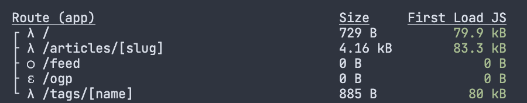

# Next.js App Dir で CSP を設定する

## はじめに

最近このブログに CSP を設定しました。
Next.js ではインラインスクリプトが使われているので Nonce の設定が必要なのですが、
App Dir での Nonce 設定方法が公式ドキュメントに書かれていなかったので、ここにやり方をまとめておきます。

ちなみに App Dir を使用していない場合は `_document.tsx` の `<NextScript>` に `nonce` を渡せばいいです。

**注意**: この記事では未だ公式ドキュメントで明文化されていない仕様を使用しています。
おそらく新しすぎてまだドキュメントになっていないだけだと思いますが、将来的に変更される可能性もありますのでご注意ください。

## 設定方法

### Middleware の作成

Next.js で共通のレスポンスヘッダーを設定する場合は `next.config.js` に記述すればいいのですが、
これは静的な設定になってしまうので、動的に設定したい場合は Middleware を使います。

`src/` 下に `middleware.ts` を作成し、Nonce の生成と CSP の設定を行います。

```typescript
import type { NextRequest } from "next/server";
import { NextResponse } from "next/server";

import { bufferToHex } from "./lib/utils";

export function middleware(req: NextRequest): NextResponse | void {
  // Nonceの生成
  const nonce = generateNonce();
  // CSPヘッダの生成
  const csp = generateCspHeader(nonce);

  // リクエストヘッダを取得
  const headers = new Headers(req.headers);

  // コンポーネント側で取得できるようにリクエストヘッダにも設定
  headers.set("X-CSP-Nonce", nonce);
  // Next.jsが差し込むインラインスクリプトにもNonceが設定されるようにリクエストヘッダにもCSPを設定
  headers.set("Content-Security-Policy", csp);

  // 改変したリクエストヘッダをNextResponseに渡す
  const response = NextResponse.next({
    request: {
      headers,
    },
  });

  // レスポンスヘッダにCSPを設定
  response.headers.set("Content-Security-Policy", csp);

  return response;
}

// Nonceのビット長
// 参考: https://w3c.github.io/webappsec-csp/#security-nonces
const NONCE_BIT_LENGTH = 128;

// Nonceの生成
// Node.jsのAPIは利用できないので、Web Crypto APIを使用
function generateNonce(): string {
  return bufferToHex(
    crypto.getRandomValues(new Uint8Array(NONCE_BIT_LENGTH / 8))
  );
}

// CSPヘッダの生成
function generateCspHeader(nonce: string): string {
  const scriptSrc = [
    "'self'",
    // 開発環境ではevalを許可
    process.env.NODE_ENV === "development" && "'unsafe-eval'",
    `'nonce-${nonce}'`,
    // Twitterの埋め込みやGoogle Tag Managerを使っている場合は適宜設定
    "https://www.googletagmanager.com",
    "https://platform.twitter.com",
  ]
    .filter(Boolean)
    .join(" ");

  // CSPの設定
  // 自分のサイトの状況に応じて適宜設定
  const csp = [
    "default-src 'self'",
    "connect-src 'self' https://www.google-analytics.com",
    "frame-src 'self' https://www.googletagmanager.com https://platform.twitter.com",
    `script-src ${scriptSrc}`,
    "style-src 'self' 'unsafe-inline'",
    "font-src * data:",
    "img-src * data:",
  ].join("; ");

  return csp;
}

// ArrayBufferを16進数の文字列に変換する
function bufferToHex(buffer: ArrayBuffer): string {
  return Array.from(new Uint8Array(buffer))
    .map((byte) => byte.toString(16).padStart(2, "0"))
    .join("");
}
```

### Script の設定

Google Tag Manager や Google Analytics のために `next/script` を使用してる場合は `<Script>` にも Nonce を設定する必要があります。
そこで Middleware で設定した `X-CSP-Nonce` を利用してコンポーネント側で生成された Nonce を受け取ります。

```tsx
import { headers } from "next/headers";

type Props = {
  children: ReactNode;
};

export default function Layout({ children }: Props): JSX.Element {
  // Middlewareで設定したX-CSP-Nonceを取得
  const nonce = headers().get("X-CSP-Nonce") ?? "";

  return (
    <html lang="ja">
      <body>
        {children}
        {/* Nonceを設定 */}
        <Script id="script" strategy="afterInteractive" nonce={nonce}>
          {`...`}
        </Script>
      </body>
    </html>
  )
```

### インラインスクリプトの Nonce の設定

Next.js ではインラインスクリプトが使われているので、これにも Nonce を設定する必要がありますが、公式ドキュメントにはその方法が書かれていません。
実は CSP ヘッダーに Nonce が設定されている場合は自動的にインラインスクリプトにも Nonce が設定されるようです。
この仕様を利用するために Middleware でレスポンスヘッダだけでなくリクエストヘッダにも CSP を設定していました。

https://github.com/vercel/next.js/blob/05f6de10869021dbb6124e174778e2108c9b4e8e/packages/next/src/server/app-render.tsx#L685

若干注意なのですが、CSP で`script-src`と`default-src`どちらも設定している場合、
`script-src`にある Nonce しか確認されないので Script 以外にも Nonce を使う場合は
`default-src`と`script-src`の両方に Nonce を設定する必要があります。

### 静的生成ページの削除

Middleware が使われている場合は静的生成の条件を満たしているページでも勝手に動的に生成になりますが、
Dynamic Routing 下で`generateStaticParams`を使っている場合は静的になってしまいます。
そのため`generateStaticParams`を使っている場合は動的に生成するように削除する必要があります。

`next build` でビルドしたときに ◯ の静的ページが無いようにしましょう。
(スクショの`/feed`は静的生成になってますが、これは RSS の生成なので問題ないです。)



## 最後に

Middleware ベースの CSP 設定は楽ではありますが、全てのページを動的にする必要があるのが難点です。
(といっても現状はこれしか方法が無いのですが…)

Next.js の App Dir はまだ Beta 機能で色々と機能不足な点はありますが、
従来の `pages/` ベースのルーティングに比べて便利な点も多いので、
早く Stable になってほしいです。
