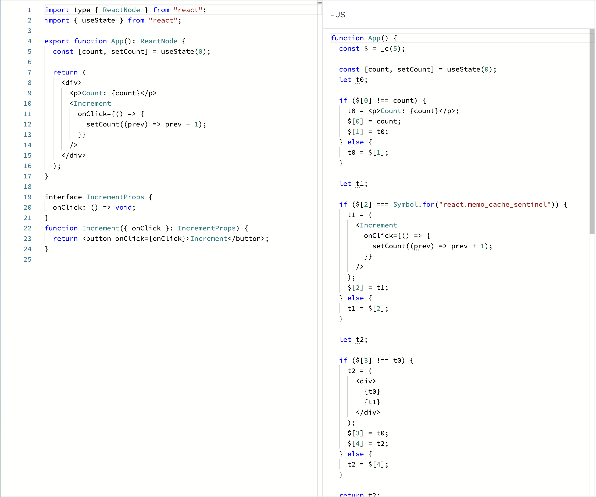

# React v18でReact Compilerを使う&一部のコンポーネントだけReact Compilerで最適化する方法

## はじめに

先日、React Compilerがオープンソースになり、誰でも利用できるようになりました。
しかしながら、React CompilerはReactのベータ版が必要になり、本番環境でガッツリ利用するのは少し難しいです。

そこで、今回はReact CompilerをReact v18でも利用できるようにする方法を紹介します。
また、一度に全てのコンポーネントをReact Compilerで最適化するのは、リスクを伴うため、一部のコンポーネントだけをReact Compilerで最適化する方法も紹介します。

なお、React Compiler自体がまだベータ版であることに留意してください。

## React Compilerとは

React Compilerはコンポーネントやフックを自動的に最適化するためのツールです。
具体的にはコンポーネントやフックに含まれる値をメモ化し、不要な再レンダリングを抑制することで、パフォーマンス向上が期待できます。

今まではメモ化するためにユーザーが手動で`useMemo`, `useCallback`, `React.memo`などを使う必要がありましたが、React Compilerを使うことで、これらの手間を省くことができます。

React Compilerはその名の通り、コンパイラとして動作します。
具体的にはビルドツールと連携することで、ユーザーが書いたコードそのものを変換します。

現在はBabelのプラグインとしてのみ提供されていますが、今後はRustでの実装になるようです。[^1]

[^1]: 現に、Reactのリポジトリにはbabelの実装コードと、Rustの実装コード(まだ未完成)が存在しています。



## React Compilerの導入方法

[公式ドキュメント](https://ja.react.dev/learn/react-compiler#installation)に記載の通りですが、一応導入方法を紹介します。
なお、今回はViteを使います。

まず、React CompilerのBabel実装である`babel-plugin-react-compiler`をインストールします。

```bash
npm install -D babel-plugin-react-compiler
```

次に、`vite.config.js`に以下のように設定します。

```js
export default defineConfig({
  plugins: [
    react({
      babel: {
        plugins: [["babel-plugin-react-compiler", {}]]
      },
    }),
  ],
});
```

`"babel-plugin-react-compiler"`の隣の空オブジェクトはオプションです。React 18でReact Compilerを使う場合は追加の設定が必要なので、後で解説します。
Reactのbeta版を使う場合はこれで設定は完了です。

## React v18でReact Compilerを使う

ここからはReact v18でReact Compilerを使うための設定方法を紹介します。
まず、React Compilerではコンパイル後のコードに`c`という関数が追加されるため、それを追加する必要があります。[^2]

[^2]: 実際には`_c`という関数になっていますが、ベータ版に含まれる`c`関数の実装である`react-compiler-runtime`には`c`として定義されているため、ここでは`c`として説明します。

`c`関数はReactのbeta版には含まれていますが、React 18には含まれていません。
`babel-plugin-react-compiler`では自分で定義した`c`関数を使うように設定することができるため、まずは自分で`c`関数を定義します。

```ts
import { useState } from "react";

const $empty = Symbol.for("react.memo_cache_sentinel");

/**
 * DANGER: this hook is NEVER meant to be called directly!
 *
 * Note that this is a temporary userspace implementation of this function from
 * React 19. It is not as efficient and may invalidate more frequently than the
 * official API. Please upgrade to React 19 as soon as you can.
 */
export function c(size: number) {
  return useState(() => {
    const $ = new Array(size);
    for (let ii = 0; ii < size; ii++) {
      $[ii] = $empty;
    }
    // @ts-ignore
    $[$empty] = true;
    return $;
  })[0];
}
```

この`c`関数は[こちらのGist](https://gist.github.com/poteto/37c076bf112a07ba39d0e5f0645fec43)からお借りしました。
なおこれはReactのベータに含まれる[`react-compiler-runtime`](compiler/packages/react-compiler-runtime/src/index.ts)と同じです。

これを`src/react-compiler-runtime.ts`として保存します。後でパスを指定しますが、ファイル名や場所は自由です。

次に、`vite.config.js`を以下のように修正します。

```js
export default defineConfig({
  plugins: [
    react({
      babel: {
        plugins: [
          [
            "babel-plugin-react-compiler",
            {
              runtimeModule: path.resolve("src/react-compiler-runtime"),
            },
          ],
        ],
      },
    }),
  ],
});
```

`runtimeModule`オプションに先ほど作成した`src/react-compiler-runtime.ts`のパスを指定します。
これでReact Compilerがビルド時に自分で定義した`c`関数を使うようになります。

これでReact 18でもReact Compilerを使う準備が整いました。
後はいつも通りにビルドすれば、React Compilerがコンパイル時にコンポーネントを最適化してくれます。

**なお執筆現在、`@vite/plugin-react` v4.3.0には`runtimeModule`オプションを指定した際にエラーが発生するバグがあります。v4.2.1にダウングレードすることで回避可能です。**
詳細は[こちらのIssue](https://github.com/vitejs/vite-plugin-react/issues/328)を参照してください。(PRも立っているので、そのうち修正されると思います)

## 一部のコンポーネントだけReact Compilerで最適化する

さて、ここまではReact Compilerを動かす方法を紹介してきました。
しかし、一度に全てのコンポーネントをReact Compilerで最適化するのはリスクが伴います。
特に、React Compilerはまだベータ版であり、いきなり全てのコンポーネントを最適化すると予期せぬバグが発生する可能性があります。
一応、React CompilerはReactのルールに則っているコンポーネント・フックのみを最適化するようになっていますが、それでもリスクはゼロではありません。

徐々にReact Compilerを導入していくために`babel-plugin-react-compiler`ではコンパイラの最適化をOpt-inにすることができます。
まずは、`vite.config.js`の設定を以下のように変更します。

```js
export default defineConfig({
  plugins: [
    react({
      babel: {
        plugins: [
          [
            "babel-plugin-react-compiler",
            {
              runtimeModule: path.resolve("src/react-compiler-runtime"),
              compilationMode: "annotation",
            },
          ],
        ],
      },
    }),
  ],
});
```

`compilationMode`オプションに`"annotation"`を指定することで、React Compilerの最適化をOpt-inにすることができます。
このオプションを設定すると、コンポーネントに`"use memo"`というディレクティブを追加しないとReact Compilerが最適化を行いません。

```tsx
function MyComponent() {
  "use memo";

  return <div>"Hello, world!"</div>;
}
```

このように、コンポーネントの先頭に`"use memo";`と書くことで、そのコンポーネントだけをReact Compilerで最適化することができます。
これによって、徐々にReact Compilerを導入していくことができます。
なお、このディレクティブはReact Compilerの移行期にのみ使うように想定されており、長期的な利用は推奨されていません。

詳しくは[公式ドキュメント](https://ja.react.dev/learn/react-compiler#using-the-compiler-effectively)を参照してください。

## まとめ

今回はReact v18でReact Compilerを使う方法と、一部のコンポーネントだけをReact Compilerで最適化する方法を紹介しました。
React Compilerはまだベータ版であり、本番環境で利用するのはリスクが伴いますが、徐々に導入していくことでパフォーマンス向上が期待できます。

また、React Compilerの中身を[@yossydev](https://x.com/yossydev)、[@re_taro_](https://x.com/re_taro_)と一緒に読む動画も公開しているので、興味があればぜひご覧ください。

[React Compiler Code reading #1](https://www.youtube.com/watch?v=PqPgr_hlVKM)

## 参考

- [Using the compiler on < React 19](https://github.com/reactwg/react-compiler/discussions/6)
