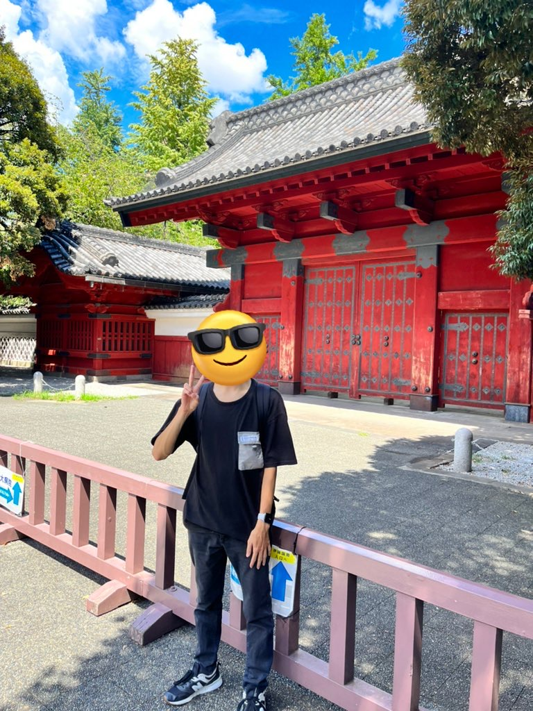
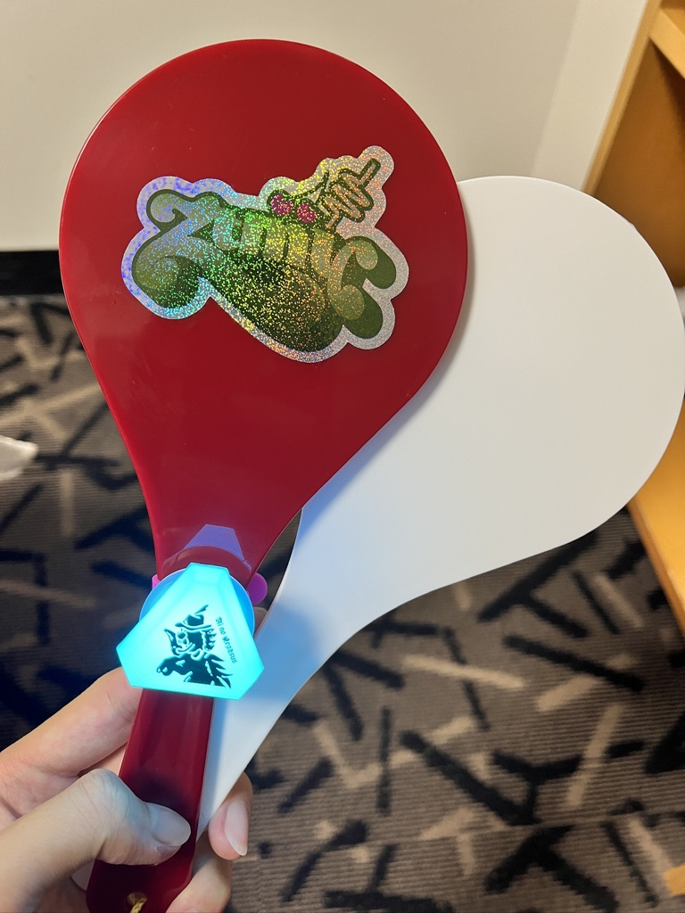
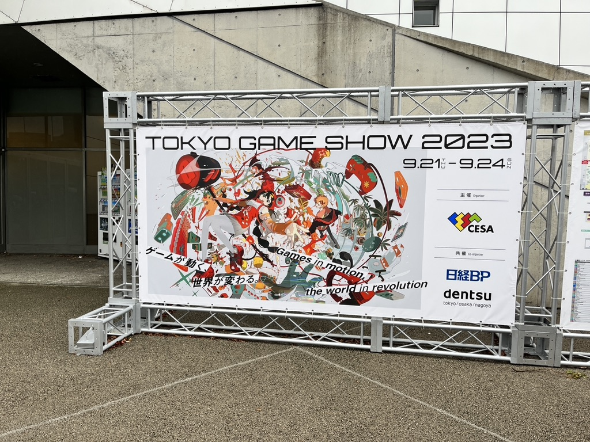
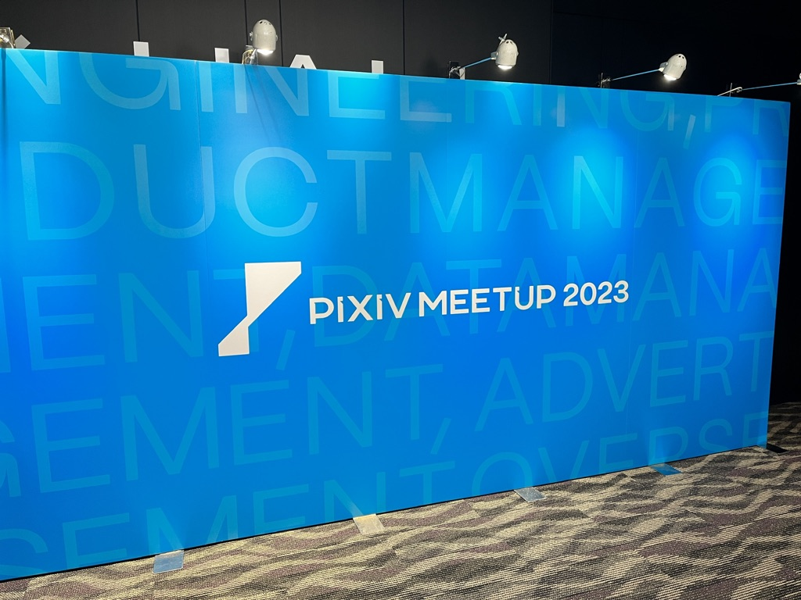
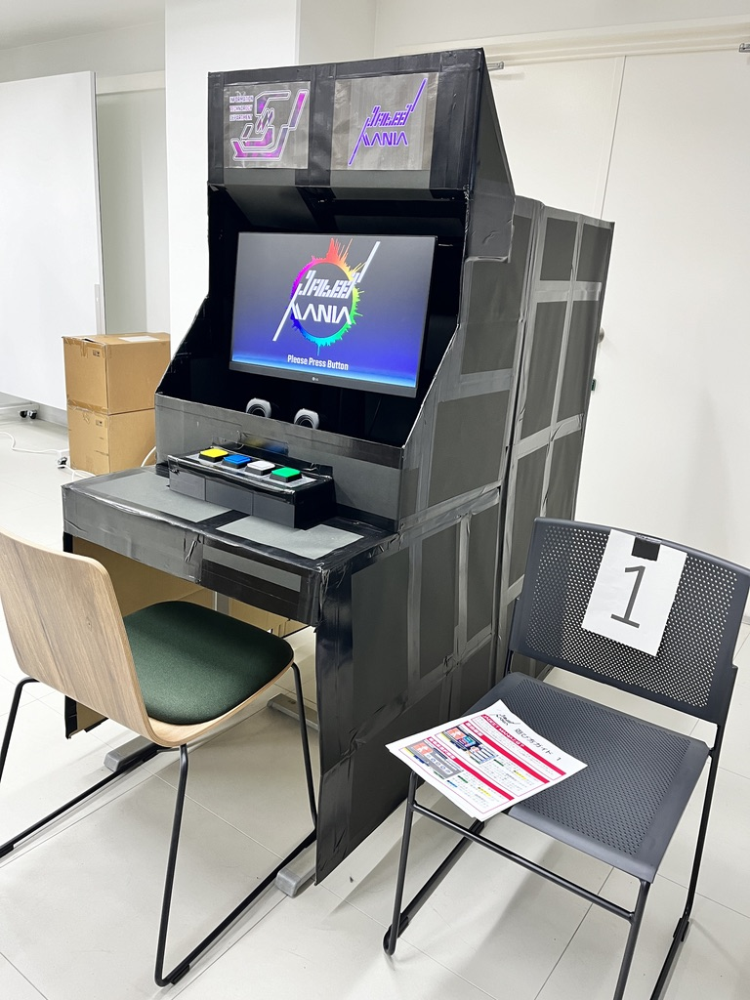
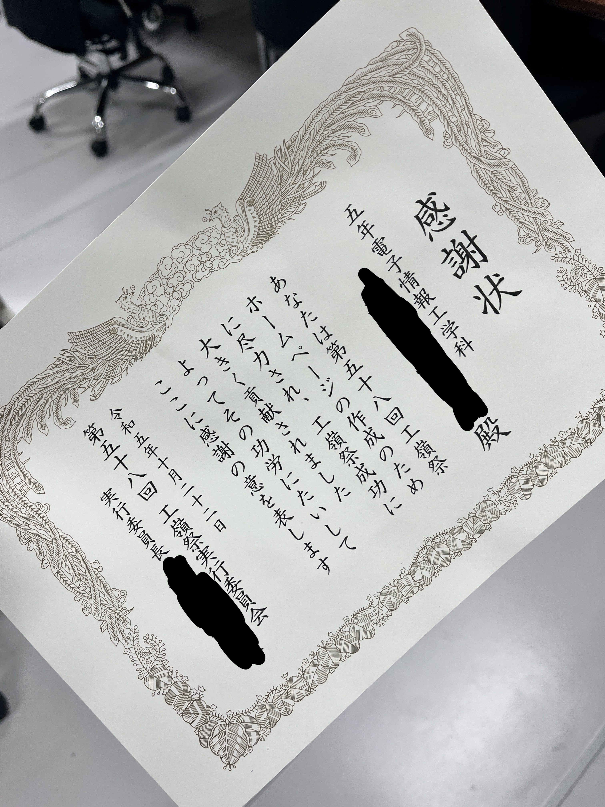

# 2023年の振り返り

毎年恒例の1年間の振り返りです。なんだかんだで3年目になりました。
やっぱり自分のブログがあるとカジュアルにこういった記事を書くことができていいですね。
皆さんも是非自分のブログを作ってみてはいかがでしょうか？

ちなみに今はblog.s2n.techのv3を準備中です。公開したらまた紹介記事を書くので乞うご期待です。

## 冬

### 自分のブログを作る

blog.s2n.techのv2を作りました。元々はv1というかなり急ごしらえのブログだったのですが、v2にしてから大幅にパワーアップしました。
OGP対応やRSS対応、アクセシビリティ対応など自分がブログに求める機能をほぼ実装することができました。

ここ1年ほど運用してみて不満点も出てきたので現在はv3を準備中です。v3ではv2で実装した機能をより良いものにしていきたいと思っています。

https://blog.s2n.tech/articles/blog-v2

## 春

### 編入勉強を始める

自分は高専卒業後の進路を進学にしようと思っていたので、大学への編入を目指して志望先の大学を絞り込んだり、編入試験の勉強を始めました。
**ちなみにですが4年生以下の皆さんはこのスケジュールを参考にしないでください。**本来はもっと早くから始めるべきですし、実際に試験を受けた身としてももっと早くから始めておけばよかったと思っています。

### 5年生になる

高専5年目に突入しました。5年生になるとクラスの教室というものがなくなり、それぞれの研究室で普段は過ごすことになります。初めはそれがなかなか新鮮で、遅くまで研究室に残って研究を進めたり、近くのスイーツ店でスイーツを買ってきて食べたりしていました。
また授業も少なくなり、自由に使える時間が増えたので空き時間は編入勉強に充てていました。

### 自分の書いた記事がバズる

TypeScript 5.0で追加された機能について紹介した記事を書いたら、ものすごくバズりました。
JSer.infoなどでも取り上げられたり、ChromeのDiscoverにも載ったりして、自分の記事がこんなにも多くの人に読まれるとは思ってもみませんでした。
技術記事でバズるのは初めてだったので結構嬉しかったです。

https://blog.s2n.tech/articles/dont-use-moduleresolution-node

### 20歳になる

ついに20歳になってしまいました。なんというかあまり実感はありませんが、なんとなく責任感が増した気がします。

https://twitter.com/shun_shobon/status/1649428621029720064

https://blog.s2n.tech/articles/review-20th

### GWに東京旅行

GWに2日間の東京旅行に行きました。
実はちょうど1年前にも東京旅行に行っていて、そのときは初めての一人旅行で駅の中で20分くらい迷子になったりもしましたが、今回はそんなこともなくスムーズに移動することができ、自分の成長を感じました。

この旅行は単に友達に会いに行くというだけではなく、この後の編入試験の下見も兼ねていました。
実際の大学を見てみると、なんとなくイメージが湧いてきて、編入試験のモチベーションにもなりました。

2日目は友達([@re_taro_](https://twitter.com/re_taro_)、[@su8ru_](https://twitter.com/su8ru_)、[@2RiniaR](https://twitter.com/2RiniaR))と一緒にポピーを見に行きました。
なかなか会えない友達(と言うか初めて会った人もいる)と会えてとても楽しかったです。

https://twitter.com/shun_shobon/status/1654897634149281793

### 編入試験を受ける & 大学合格

GW明けに編入試験を受けました。
長野からだとあさイチに行っても間に合わないので、前日に近くのホテルに泊まってから受験しました。
試験前に大学へのルートを確認したりと入念に下見をしていたので、試験当日はスムーズに受験することができました。
自分は2つの大学を受けましたが、片方は不合格でした。
ただ、本命の大学には合格できたので良かったです。
これで進路が決まっていないという不安感も無くなったので、かなり気分が楽になりました。

### ツイートがバズる

学校のオープンキャンパスでの出来事をツイートしたら、何故かバズりました。
テレビのニュースにもちょっとだけ取り上げられたりして、自分の部活をアピールすることができてちょっと嬉しかったです。

https://twitter.com/shun_shobon/status/1677560453042671617

(ところでこれは振り返りに書くべき内容なのか？)

## 夏

### 東大で富岳を触る

富岳を体験しよう！みたいなイベントにたまたま参加できたので、東大に行って富岳を触ることができました。
富岳を触るという貴重な体験ができ、スーパーコンピューターの凄さを改めて感じました。

また、自分としては初めての東大訪問だったので、東大のキャンパスを見て回ることができてとても楽しかったです。
いわゆる赤門の前で写真を撮ったりもしました(赤門入れなかったけど)。

### 北海道旅行

家族で北海道旅行に行きました。
初めての北海道でしたが、観光したり美味しいものを食べたりと結構楽しかったです。
ただ結構急ぎめのスケジュールだったので、今度は友達とゆっくり行きたいなあと思いました。

### 3日間の東京旅行

夏休みの最後に3日間の東京旅行に行きました。
この東京旅行では「ずっと真夜中でいいのに。」のライブに行ったり、Tokyo Game Showに行ったりしました。
一人でライブに行くのは初めてで、ちょっと不安でしたが、ライブ自体はとても楽しめました。
元々ずとまよ好きでしたが、ライブ行ってからもっと好きになりました。また機会があれば今度は友達とライブ行きたいなあと思っています。
TGSは友達と一緒に行ったのですが、あまりの人の多さに圧倒されました。
ゲームの展示を見たり、VR機器の体験をしたりと楽しむことはできましたが、人が多すぎて結構疲れました…

### PIXIV MEETUP 2023に参加する

PIXIV MEETUP 2023というpixiv主催の技術カンファレンスに参加しました。
pixivの新MVVが発表されたり、pixiv社員の方の発表を聞いたりと勉強になりましたし、インターンのときにお世話になった方ともお会いできてよかったです。

## 秋

### 工嶺祭

高専生活最後の学園祭である工嶺祭がありました。
去年、一昨年に引き続き工嶺祭HP制作を担当しました。
周りの反応を聞くと今年は結構たくさんの人にHPを見てもらえたし、いいね！と言ってもらえたりしたので、自分としては満足しています。

HP制作以外にもクラス展示のための装飾を作ったり、当日の宣伝活動をしたりとなかなか忙しかったですが、屋台を回ったり、展示を見たりと楽しむこともできました。

最後には表彰式でHP制作を表彰してもらえたので、自分の高専生活の締めくくりになったと思います。

## 冬

### 長野高専のアドベントカレンダーを主催

去年、一昨年に引き続き、長野高専のアドベントカレンダーを主催しました。
去年以上の盛り上がりで去年参加していない方やOBの方にも参加してもらえたので、開催してよかったなあと思っています。

https://qiita.com/advent-calendar/2023/nnct

## 終わりに

今年は前半に編入試験があって忙しかったですが、編入試験後は結構色々なことをやることができたかなと思います。その反面、あまりプログラミングに時間を取れなかったので、来年は趣味開発をたくさんして、技術力を高めていきたいなあと思います。

それでは皆さん、良いお年を〜👋
