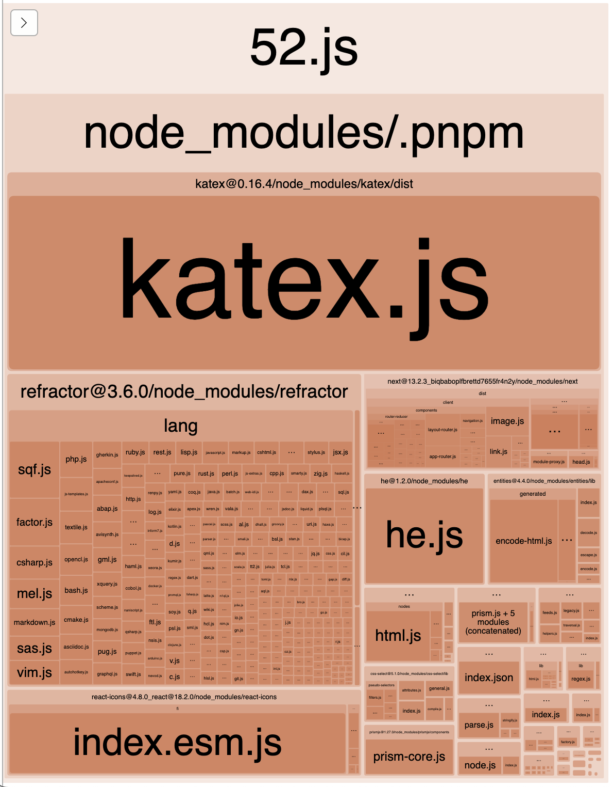

# KaTeX と React Syntax Highlighter を React Server Component に対応させる

## はじめに

このブログは Next.js 13 で新しく追加された App Dir + React Server Component(RSC)を使って実装しています．
RSC はクライアントサイドのバンドルサイズを非常に小さくすることができますが，RSC では `useState` などの副作用や
`Provider` などのコンテキストが使えないため，インタラクティブなことはほぼすることができません．
(もっとも，アップデートなどでそのうちできるようになるかもしれませんが．)

ブログというのは静的な情報がほとんどなので，RSC と非常に相性がいいです．このブログでも RSC を多用していますが，
数式の表示に使用していた $\KaTeX$ (`react-katex`)とシンタックスハイライトに使用していた`react-syntax-highlighter`
に関しては RSC にするのに若干ハマったので，その解決方法をまとめておきます．

## 解決方法

### KaTeX

KaTeX に関してはかなり解決方法が簡単で，`react-katex`を使わず自分で`katex`コンポーネントを使って実装すればいいだけです．
というのも，`react-katex`は`katex`をただラップしてるだけで，やってることは`katex`に数式を渡して，生成された HTML を`dangerouslySetInnerHTML`で埋め込んでるだけです．
自分で実装すれば`props-types`などの余計なライブラリをインストールする必要も無くなるのでこのほうがいいかもしれません．

```tsx
import katex from "katex";

type Props = {
  math: string;
};

export function Math({ math }: Props): JSX.Element {
  return (
    <div
      dangerouslySetInnerHTML={{
        __html: katex.renderToString(math, { displayMode: true }),
      }}
    />
  );
}
```

### React Syntax Highlighter

React Syntax Highlighter に関してはインポート先を変えると RSC に対応できます．
公式では`react-syntax-highlighter`からコンポーネントをインポートしてますが，
`react-syntax-highlighter`からインポートしようとすると RSC に非対応の非同期版のコンポーネントも一緒に読み込んでしまい，うまく動きません．
そのため，`react-syntax-highlighter/dist/esm/prism`からコンポーネントをインポートすれば同期版のコンポーネントだけを読み込むことができます．

```tsx
import type { Code as CodeNode } from "mdast";
// これだとうまく行かない
// import { Prism as SyntaxHighlighter } from "react-syntax-highlighter";
import SyntaxHighlighter from "react-syntax-highlighter/dist/esm/prism";
import { nord as style } from "react-syntax-highlighter/dist/esm/styles/prism";

type Props = {
  code: string;
  lang: string;
};

export function Code({ code, lang }: Props): JSX.Element {
  return (
    <div>
      <SyntaxHighlighter
        language={lang ?? undefined}
        style={style}
        showLineNumbers
      >
        {code}
      </SyntaxHighlighter>
    </div>
  );
}
```

## 終わりに

Next.js の RSC は非常に強力な機能ですが執筆現在は未だ Beta 機能ですし，対応しているライブラリも少ないです．
RSC が一般的になれば，そのうちライブラリ側も RSC に対応していることを明示するようになるかもしれません．
そうなるまではライブラリのソースコードを読んだり実際に試したり，自分で実装するしかなさそうです．

ちなみに RSC を多用するとフロントエンドのバンドルサイズは減少しますが，バックエンドのバンドルサイズはどんどん増加していきます．
現状ではこのブログのバックエンドのバンドルサイズはかなりの割合を KaTeX と react-syntax-highlighter の言語ファイルが占めています．
とても Edge に乗るようなサイズではなくなってしまったのでこれもどうにかしたいですね...


